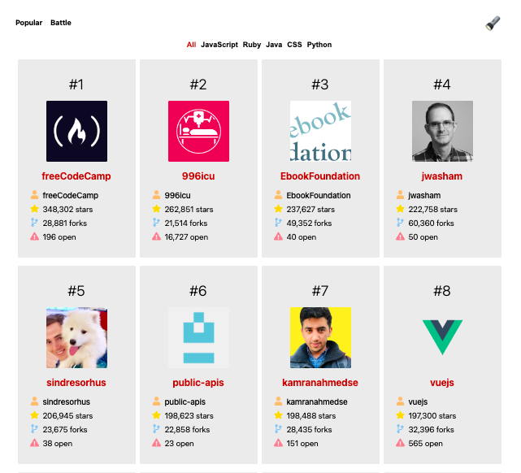
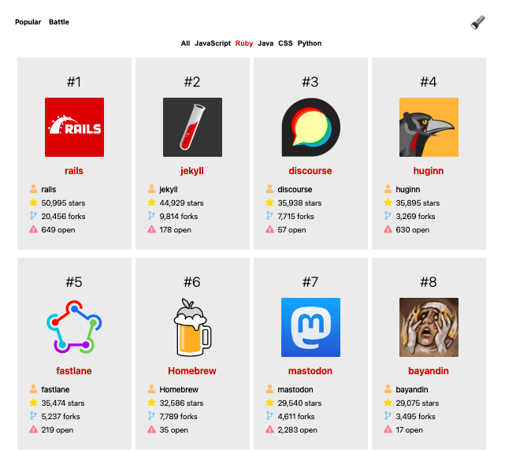
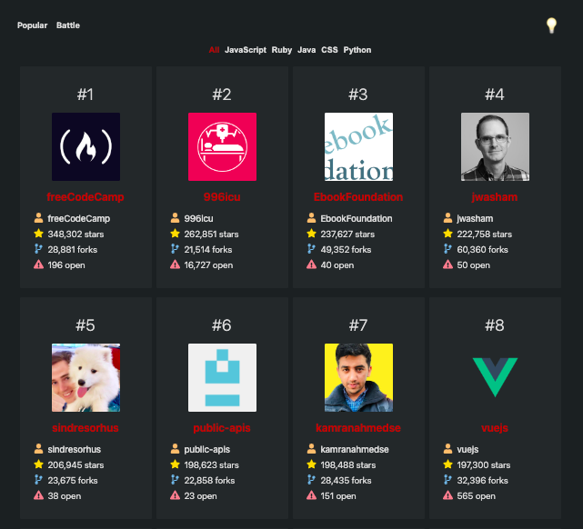
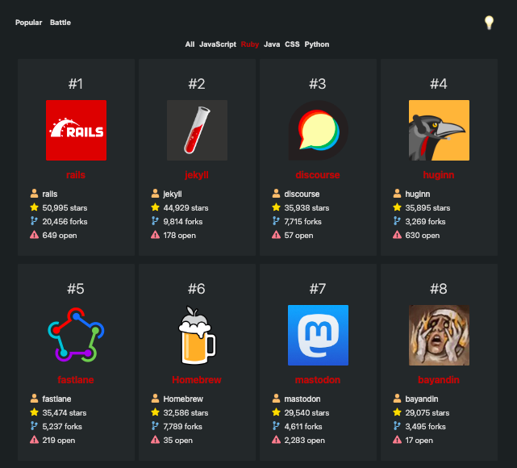
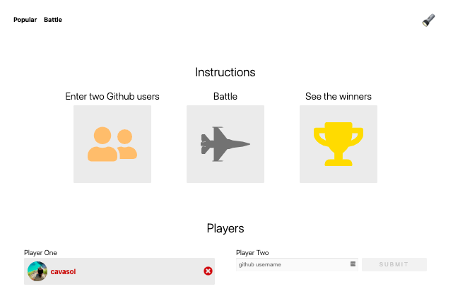
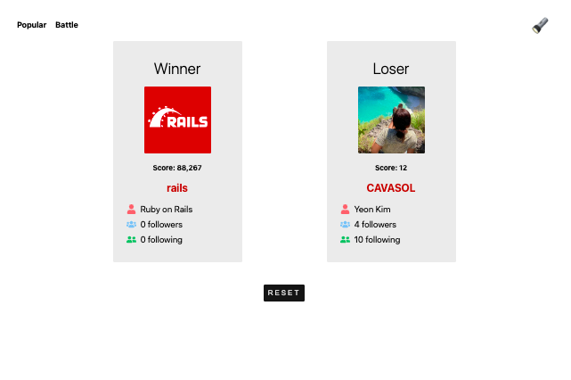
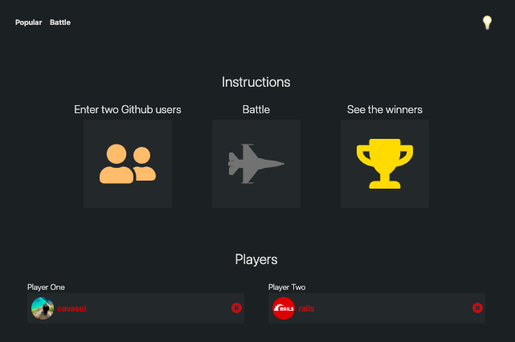
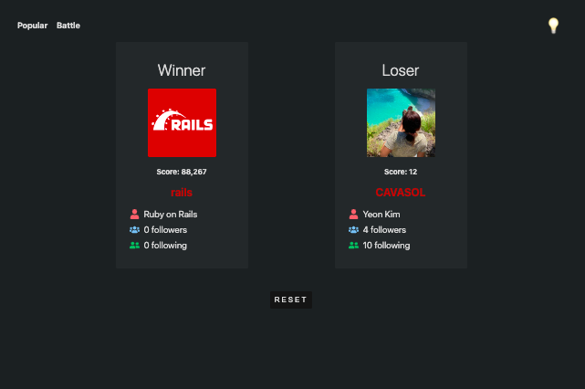

# Githubio

This project is a "Githubio" app from ui.dev's "React" course project. Githubio consists of two pages, Popular and Battle. You'll be able to see the most popular repos for a variety of languages as well as battle two Github users to see who has the better profile.

## Popular preview

Light Mode          |  Dark Mode
:-------------------------:|:-------------------------:
  |  

## Battle preview

Light Mode          |  Dark Mode
:-------------------------:|:-------------------------:
  |  

